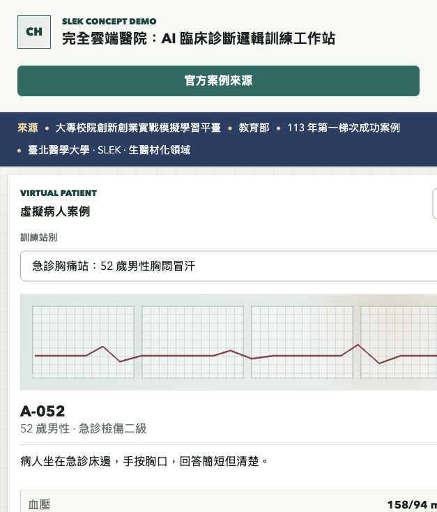
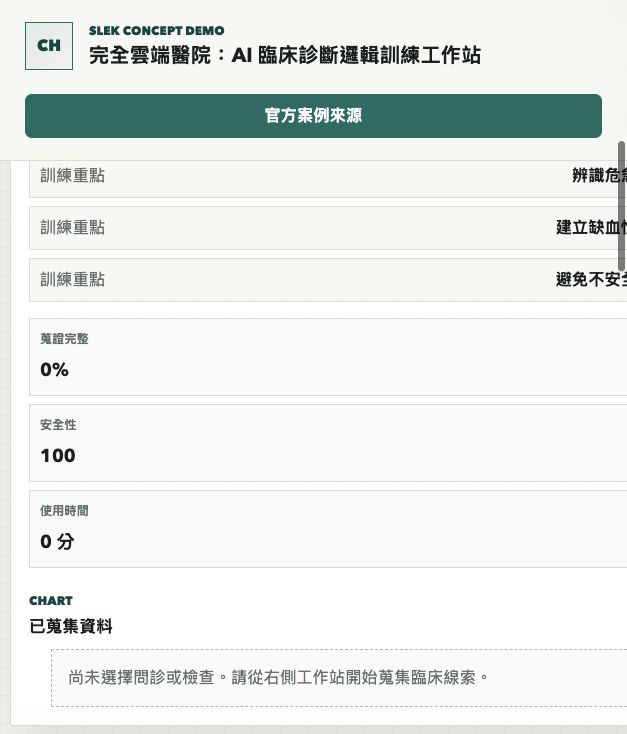

# 完全雲端醫院：AI 臨床診斷邏輯訓練平台 Demo

## 快速看懂

- 線上 Demo：https://atlasforcn.github.io/startup-cloud-hospital-training/
- 這個原型在做什麼：把完全雲端醫院做成 AI 臨床診斷邏輯訓練平台。
- 特色定位：特色是讓醫學生在虛擬病人案例中練問診、檢查、鑑別診斷與教師回饋。
- 操作流程：選擇虛擬病人案例 → 提出問診與檢查選項並查看線索 → 提交診斷後取得 AI/教師式回饋與成績

展開完整功能流程截圖

這個 repo 是以「完全雲端醫院：結合 AI 的醫學生線上臨床診斷邏輯訓練平台」為核心概念製作的前端互動 demo。原作品來自教育部「大專校院創新創業實戰模擬學習平臺」113 年第一梯次成功案例，臺北醫學大學團隊/作品「完全雲端醫院：結合 AI 的醫學生線上臨床診斷邏輯訓練平台」，公司/團隊為 SLEK，所屬領域為生醫材化領域。

官方來源：https://ssp.moe.gov.tw/cases/1046

## 比賽來源

- 平臺：大專校院創新創業實戰模擬學習平臺
- 主辦/來源：教育部
- 屆次/階段：113 年、第一梯次成功案例
- 學校：臺北醫學大學
- 團隊/作品：完全雲端醫院：結合 AI 的醫學生線上臨床診斷邏輯訓練平台
- 公司/團隊：SLEK
- 領域：生醫材化領域

## 核心概念

以 AI 輔助的虛擬醫院與標準化病人情境，讓醫學生在線上反覆練習臨床問診、檢查選擇、鑑別診斷排序與診斷推理。Demo 將概念收斂為 OSCE/臨床推理訓練工作站，聚焦「如何從病人線索逐步形成診斷假說」。

## Demo 範圍

- 虛擬病人案例切換
- 問診與檢查項目選擇
- AI 診斷推理提示，以離線規則模擬學習提示
- 鑑別診斷與主要診斷提交
- 教師回饋、分數與歷次成績紀錄

本 demo 僅供醫學教育情境展示，不連接真實 AI 模型，不處理真實病人資料，也不提供醫療診斷或治療建議。

## 使用方式

直接以瀏覽器開啟 `index.html` 即可操作，不需要安裝套件或建置工具。
